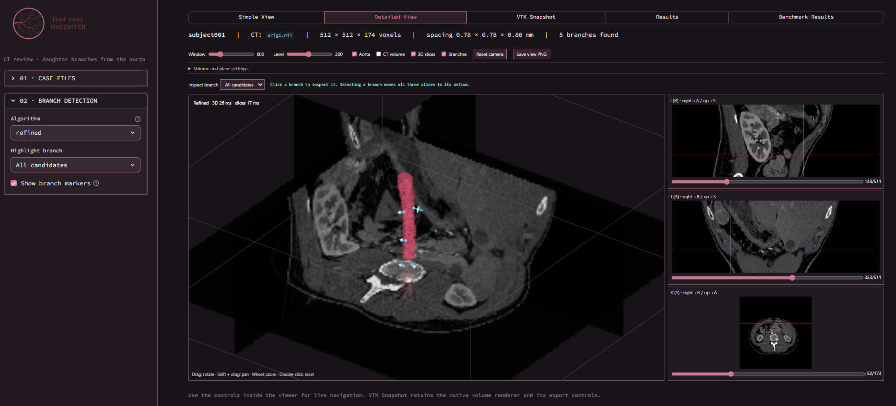

# Find Your Daughter

[](https://www.python.org/)
[](https://streamlit.io/)
[](https://scikit-image.org/)
[](https://simpleitk.org/)
[](https://vtk.org/)

🏆🫀 **2nd place** winner in the **Healthcare Track with [Toralis Labs](https://toralislabs.com/)** at [**Battle of the Schools 2026**](https://www.utwat.ca/). Check out our [Devpost](https://devpost.com/software/findyourdaughter) and [demo video](https://youtu.be/cpjb8N-eNfQ)!

<div align="center">
  
  
</div>

## Overview

**Find Your Daughter** is a CPU-only medical-imaging project that detects direct
daughter arteries leaving the abdominal aorta. It accepts a CT NIfTI volume and
a binary mask containing only the parent aorta, then returns candidate daughter
instances in physical patient space.

The project was built for the Branchseed Challenge in the Toralis Labs Healthcare
track. It includes an evaluator-compatible command-line backend, four
experimental detection algorithms, reproducible synthetic data generation, and
offline visualization tools for reviewing candidate geometry.

## What It Does

For each proposed direct daughter, the pipeline reports:

- The ostium, where the vessel leaves the aortic wall.
- A seed point approximately 5 mm along the traced branch.
- An estimated seed radius in millimetres.
- A unit direction vector from ostium toward seed.
- Stable instance IDs such as `branch_001`.

Coordinates are converted from voxel indices to SimpleITK LPS physical
coordinates. The backend validates image and mask geometry, preserves spacing
and orientation, and writes the required JSON envelope:

```json
{
  "case_id": "subject001",
  "parent": { "instance_id": "aorta" },
  "daughters": []
}
```

The system does not assign anatomical vessel names, segment the parent aorta,
infer branches outside the scan, or reconstruct the complete distal vascular
tree.

## Features

### Direct Daughter Detection

- Intensity-based enhanced-lumen proposal generation.
- 3-D skeletonization and graph-based path tracing.
- Boundary contact and vesselness evidence for candidate filtering.
- Geometric rejection of cropped ends, wall-following paths, weak tubes, and
  duplicate openings.
- Physical-space seed, radius, and direction measurements.

### Four Detector Variants

- `baseline`: fast morphology and threshold-based perimeter search.
- `contact`: boundary-neighborhood contact tracking.
- `fusion`: contact geometry combined with vesselness and duplicate grouping.
- `refined`: the current default, with additional geometric refinement.

All variants are deterministic and run serially on the CPU. They are
experimental algorithms, not trained deep-learning models.

### Local Inspection and Development Tooling

- Streamlit dashboard with simple, detailed, VTK, and results views.
- Native VTK desktop viewer with linked CT slices and candidate overlays.
- Static Matplotlib previews for offline review.
- Procedural CT-like synthetic cases with daughter ground truth.
- Draft-reference evaluation, timing reports, parameter sweeps, and regression
  tests.

## Tech Stack

- Python 3.14, with the bundled wheelhouse targeting Windows x64.
- SimpleITK for NIfTI loading, resampling, and physical-coordinate conversion.
- NumPy and SciPy for array processing and geometry.
- scikit-image for 3-D skeletonization and morphology.
- Streamlit, Matplotlib, and VTK for optional visualization.
- Python `unittest` for automated checks.

## Getting Started

### Prerequisites

- Windows x64, or a compatible Python environment with matching dependencies.
- CPython 3.14 for the supplied offline wheelhouse.
- A working PowerShell terminal.
- CT and parent-aorta mask files in NIfTI format.

The repository contains local datasets and a populated `vendor/wheels/`
directory. Runtime processing does not require network access.

### Installation

Run all commands from the repository root.

1. Install the bundled backend and visualization dependencies offline:

   ```powershell
   python scripts/install_offline.py
   ```

   The installer uses `--no-index`, validates the wheelhouse platform and
   hashes, and installs the pinned requirements. The supplied wheelhouse is
   built for CPython 3.14 on Windows x64.

2. Confirm the evaluator interface is available:

   ```powershell
   python run.py --help
   ```

For a new platform or Python version, rebuild `vendor/wheels/` on an
internet-connected machine with the same operating system, architecture, and
Python version:

```powershell
python scripts/download_wheels.py
```

Do not assume binary wheels are portable between platforms or Python versions.

## Running the Backend

### Required evaluator command

The explicit image and mask form is the evaluator contract:

```powershell
python run.py --image <image_path>.nii.gz --aorta-mask <aorta_mask_path>.nii.gz --output prediction.json
```

With a repository case:

```powershell
python run.py --image dataset/subject001/orig1.nii --aorta-mask dataset/subject001/mask1.nii --output prediction.json
```

The CLI also discovers one CT and one neighboring aorta mask from a subject
directory:

```powershell
python run.py --subject dataset/subject001 --output prediction.json
```

Input loading supports ordinary NIfTI files, `.nii.gz` files, and gzip data
whose filename ends in `.nii`. Matching image and mask geometry is required.
For supported nonorthogonal inputs, the loader creates one orthogonal working
grid while preserving the physical anatomy.

### Selecting a Detector

The current default is `refined`. Select another registered detector with:

```powershell
python run.py --image image.nii.gz --aorta-mask aorta_mask.nii.gz --detector baseline --output baseline.json
python run.py --image image.nii.gz --aorta-mask aorta_mask.nii.gz --detector contact --output contact.json
python run.py --image image.nii.gz --aorta-mask aorta_mask.nii.gz --detector fusion --output fusion.json
```

Saved configurations can override detector parameters without changing source
code. The selected configuration from the documented tuning run is:

```powershell
python run.py --image dataset/subject001/orig1.nii --aorta-mask dataset/subject001/mask1.nii --config configs/tuned_20260913/refined.json --output tuned_prediction.json
```

See [docs/parameter_tuning.md](docs/parameter_tuning.md) for configuration
format, validation rules, and reproducible searches.

## Visualization

### Streamlit Dashboard

Start the optional local dashboard with:

```powershell
python -m streamlit run frontend/app.py
```

It lists scans, runs the selected detector once per input revision, and shows
candidate ostia, seeds, radii, directions, CT slices, and evaluator JSON. It
uses bundled local assets and does not need a network connection.

The same dashboard can be launched through the main entrypoint:

```powershell
python run.py --webui
```

### Native VTK Viewer

Open an interactive CPU volume viewer without a browser or web server:

```powershell
python run.py --gui --subject dataset/subject001
python run.py --gui --image dataset/subject001/orig1.nii --aorta-mask dataset/subject001/mask1.nii
```

To inspect detector candidates and save a screenshot:

```powershell
python scripts/view_nifti_3d.py --image dataset/subject001/orig1.nii --detect
python scripts/view_nifti_3d.py --image dataset/subject001/orig1.nii --detect --offscreen --screenshot nifti_previews/subject001_detection.png
```

### Static Candidate Previews

Export candidate overlays and diagnostic JSON without opening a browser:

```powershell
python scripts/preview_detection.py --image dataset/subject001/orig1.nii --aorta-mask dataset/subject001/mask1.nii --output-dir nifti_previews/detection
```

For the complete viewer controls, coordinate conventions, and rendering limits,
see [docs/development.md](docs/development.md) and
[docs/artery_detection.md](docs/artery_detection.md).

## Development Workflow

### Inspect the Dataset

Read NIfTI headers recursively without loading full volumes:

```powershell
python eda/inspect_nifti_dataset.py dataset
python eda/inspect_nifti_dataset.py dataset --output nifti_dimensions.json
```

Generate CT intensity histograms:

```powershell
python eda/plot_intensity_histograms.py --dataset dataset --output-dir nifti_histograms
```

Generate quick-look image and mask previews:

```powershell
python scripts/visualize_nifti.py --dataset dataset --output-dir nifti_previews
```

### Generate Synthetic Cases

Create deterministic CT-like data and daughter ground truth:

```powershell
python scripts/generate_synthetic_cases.py --output tmp/synthetic-development --cases 10 --seed 941 --size 128 128 192
```

Evaluate the default detector against those cases:

```powershell
python scripts/evaluate_synthetic_detection.py --dataset tmp/synthetic-development --output tmp/synthetic-development/metrics.json
```

The synthetic generator is useful for controlled geometry checks, but synthetic
performance is not clinical accuracy. See
[docs/artery_detection.md](docs/artery_detection.md) for stress-test controls.

### Evaluate and Tune Detectors

Run the registered detectors against the supplied five-case draft reference:

```powershell
python scripts/evaluate_detectors.py
```

Run a focused comparison:

```powershell
python scripts/evaluate_detectors.py --dataset eval_set --detector refined --cases 19 23 --output-dir nifti_previews/evaluation_subset
```

The draft annotations are incomplete and not expert-validated. Unreviewed
scans must not be treated as empty negative cases. Parameter sweeps and their
selection rules are documented in [docs/parameter_tuning.md](docs/parameter_tuning.md).

### Run Tests and Verification

Run the complete Python test suite:

```powershell
python -m unittest discover -s tests -v
```

Before sharing a change, also run:

```powershell
python run.py --image dataset/subject001/orig1.nii --aorta-mask dataset/subject001/mask1.nii --output prediction.json
python -m pip check
git diff --check
```

Keep generated predictions, previews, caches, datasets, virtual environments,
and experiment output out of version control.

## Project Structure

```text
backend/                  evaluator-facing detection and JSON output
core/                     NumPy scan models and preview rendering
desktop/                  native VTK viewer components
docs/                     setup, detection, evaluation, and tuning guides
eda/                      dataset inspection and histogram utilities
evaluation/               annotation and draft-reference tooling
frontend/                 optional Streamlit dashboard
scripts/                  generation, evaluation, preview, and offline tools
tests/                    automated regression tests
vendor/wheels/            pinned offline Python packages
vendor/mesa/              Windows software OpenGL libraries
configs/                  detector tuning configurations
run.py                    required evaluator and local UI entrypoint
```

Keep detection logic in `backend/`. The backend must remain independent of
Streamlit and other optional UI modules.

## Documentation

### Core Guides

- [Development and visualization](docs/development.md)
- [Detection method and candidate review](docs/artery_detection.md)
- [Contact detector](docs/contact_detection.md)
- [Fusion detector](docs/fusion_detection.md)
- [Refined detector](docs/refined_detection.md)

### Evaluation and Annotation

- [Evaluation](docs/evaluation.md)
- [Parameter tuning](docs/parameter_tuning.md)
- [Annotation workflow](docs/annotation_workflow.md)
- [Annotation status](docs/annotation_status_20260913.md)
- [Viewer performance](docs/viewer_performance.md)
